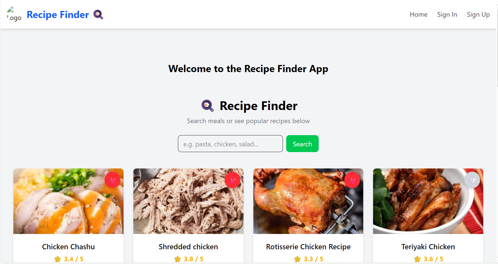
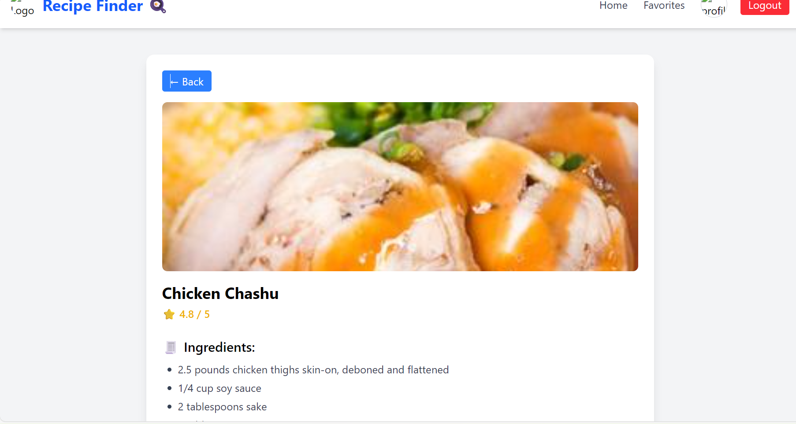
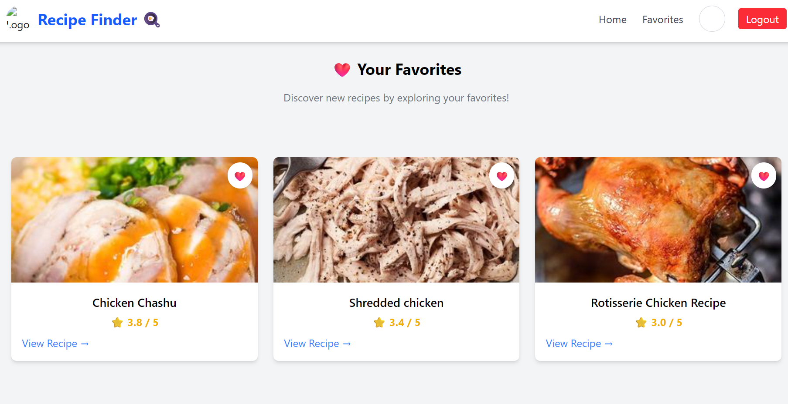

# 🍳 Recipe Finder App

A modern, responsive web application that allows users to search for recipes, view detailed instructions, and save their favorite dishes.  
Built with **React**, **Vite**, **Tailwind CSS**, and **Zustand** for state management, this app showcases clean architecture, API integration, and user-centric design.

---

## 🖼️ Preview

Here’s a quick look at the app in action:


*Search recipes and explore results in a responsive grid.*

  
*Click on a recipe to view full ingredients and instructions.*

  
*Save your favorite recipes and view them anytime.*

---

## 🚀 Live Demo

Coming soon...

---

## 🧑‍💻 About the Project

Recipe Finder is designed to make cooking easier and more fun.  
It allows users to discover thousands of recipes instantly, save their favorites, and explore new dishes — all in a clean, fast, and responsive interface.

---

## 📦 Tech Stack

| Category | Technology |
|-----------|-------------|
| **Frontend** | React (with Vite) |
| **Styling** | Tailwind CSS |
| **State Management** | Zustand |
| **Routing** | React Router |
| **API** | [TheMealDB](https://www.themealdb.com/api.php) *(or Spoonacular)* |
| **Authentication** | Firebase Auth |
| **Deployment**  I will deploy Soon | GitHub Pages / Vercel / Netlify *(planned)* |

---

## 🎯 Features

- 🔍 **Recipe Search** – Users can search for recipes by name or keyword.  
- 📄 **Recipe Details** – View full ingredients, instructions, and images.  
- ❤️ **Favorites Page** – Save and manage favorite recipes per user account.  
- 👤 **User Profile** – Update name, upload profile image, and personalize experience.  
- 🧠 **Global State** – Zustand handles recipes, favorites, and authentication states.  
- ⚡ **Responsive Design** – Mobile-first layout built with Tailwind CSS.  
- 🔄 **Routing** – Seamless navigation between pages using React Router.  

---

## 🏗️ Folder Structure
recipe-finder-app/
├── public/
├── src/
│ ├── components/
│ │ ├── Navbar.jsx
│ │ ├── Display.jsx
│ │ ├── Profile.jsx
│ │ ├── SignIn.jsx
│ │ ├── SignUp.jsx
│ │ └── Favorites.jsx
│ ├── pages/
│ │ ├── Homepage.jsx
│ │ └── RecipeDetails.jsx
│ ├── store/
│ │ └── useRecipeStore.js
│ ├── context/
│ │ └── AuthContext.js
│ ├── App.jsx
│ ├── main.jsx
│ ├── App.css
│ └── index.css
└── package.json

---

## ⚙️ Installation & Setup

Follow these steps to run the project locally:

```bash
# 1️⃣ Clone the repository
git clone https://github.com/yourusername/recipe-finder-app.git

cd recipe-finder-app

npm install

npm run dev

Then open http://localhost:5173
 to view it in your browser.
 🧪 Usage Guide

Sign Up or Log In using Firebase Authentication.

Search any recipe by name or ingredient.

Click “View Recipe” to open full details.

Click the ❤️ icon to save favorites.

Access saved recipes in the Favorites Page.

Edit your name or upload an image in the Profile section.

🧠 What I Learned

How to structure a modern React project.

State management using Zustand.

Authentication with Firebase.

Handling API data and conditional rendering.

Designing responsive layouts using Tailwind CSS.

Passing data across pages using React Router.

🚧 Future Improvements

🍽️ Add nutrition facts for each recipe.

🤖 Add AI-based recipe suggestions.

💬 Include user comments or ratings.

🧾 Add shopping list generation based on selected recipes.

☁️ Host backend and user data with Firebase Firestore or Supabase.

👨‍💻 Author

Amanuel Amare
📧 amanuelamare1221@gmail.com

💼 GitHub: https://github.com/amanuel1221/Recipe-finder-app.git

💬 “Cooking meets code — one recipe at a time!”

🪪 License

This project is licensed under the MIT License — feel free to use and modify it for your own projects.

⭐ If you like this project, please give it a star on GitHub — it helps others find it too!


---

